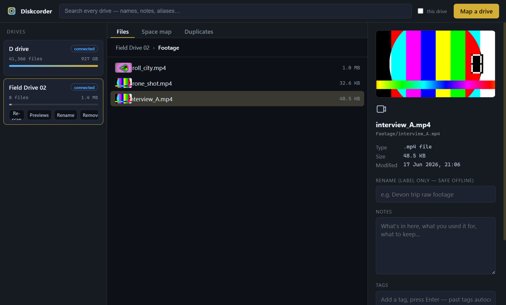

<p align="center">
  
</p>

<h1 align="center">Diskcorder</h1>

**Map your external drives once, then browse, annotate, and rename them offline.**
A local-first Electron + SQLite disk cataloguer for creators with footage spread
across many USB HDDs.



> **Free and open source** (MIT). Local-first by design — your catalog lives in a
> single SQLite file on your machine and nothing is ever uploaded. Contributions
> welcome; see [Contributing](#contributing).

Plug in a drive, map it, and Diskcorder records every file and folder into a local
catalog. After that you can browse the whole tree, search across *all* your drives,
add notes, and give files friendly labels — **even when the drive is unplugged.**
When you do have the drive connected, you can also rename files for real, on disk.

---

## Why

If your raw footage lives on a shelf of USB hard drives, "which drive has the Devon
trip B-roll?" usually means plugging in disks one by one. Diskcorder answers that
question offline: it keeps a searchable map of what's on every drive, plus your own
notes and aliases, in a single local database. Nothing leaves your machine.

## Features

- **Offline catalog** — full file/folder tree per drive, browsable while the drive
  is disconnected. Drives show a **connected / offline** badge in real time.
- **Cross-drive search** — search names, notes, and aliases across every mapped
  drive at once; results show which drive and where. Toggle "this drive" to scope it.
- **Video thumbnails + hover preview** — every video gets a still thumbnail and a
  short ~10-second clip sampled across the whole file. Thumbnails are generated
  automatically in the background right after a scan; hover a thumbnail (in the list
  or the detail pane) and it plays the preview in place. The heavier hover clips are
  built on demand, or for a whole drive via the **Previews** button. The background
  batch can be **paused, resumed, or canceled** from the ops drawer at the bottom.
- **Image thumbnails** — image files get the same on-disk thumbnail treatment and
  show inline in the listing and detail pane.
- **Space map** — a **Space map** tab with a WizTree/WinDirStat-style **colored
  treemap**: every file and folder sized by how much space it holds and colored by
  type. Click a folder tile to drill in, breadcrumb to come back. Folders in the
  normal listing also show their total subtree size.
- **Tags** — tag any file or folder; every tag you've used is remembered and
  autocompletes next time. Tags are searchable and preserved across re-scans.
- **Notes** — jot down what's in a folder, what you used it for, what to keep.
- **Virtual rename (alias)** — give a file a friendly label without touching the
  disk. Safe offline; the real filename is preserved.
- **Real rename** — when the drive is connected, rename the actual file/folder on
  disk from inside the app. Renaming a folder reconciles its descendants in the
  catalog automatically.
- **Copy / move between drives** — send a file or folder to another connected
  drive with a confirm step, live progress, cancel, and conflict handling
  (keep both / replace / skip). Streamed, so multi-GB files are fine.
- **Find duplicates** — a **Duplicates** tab groups files that share a name and
  size; toggle between **all mapped drives** and just the open one, see how much
  space is reclaimable, and delete individual copies from a chosen location. Click
  any copy to preview it in the detail pane.
- **Delete on disk** — remove the real file or folder from the detail pane, with a
  confirm step (drive must be connected).
- **Open in Explorer** — jump straight to a file's real location in Windows
  Explorer from the detail pane.
- **Export / import catalogs** — save a drive's whole catalog (with notes, aliases,
  and tags) to a JSON file and import it on another machine or restore it later.
- **Pause / resume / cancel scans** — long scans can be paused, resumed, or
  canceled from the mapping overlay (canceling discards the partial catalog).
- **Re-scan that remembers** — re-mapping a drive preserves your notes, aliases,
  and tags by matching paths.

## Install

Diskcorder uses [`better-sqlite3`](https://github.com/WiseLibs/better-sqlite3) (a
native module compiled against Electron's Node version) and bundles
[`ffmpeg-static`](https://github.com/eugeneware/ffmpeg-static) for video previews.

```bash
npm install   # postinstall rebuilds better-sqlite3 for Electron
npm start
```

**Requirements / gotchas:**

- **Node ≥ 22.12** (or 23+). Electron 42's installer loads an ES-module dependency
  via `require()`, which only works on Node 22.12+. On older Node you'll see
  `Electron failed to install correctly`; either upgrade Node or run the install with
  `NODE_OPTIONS=--experimental-require-module`.
- **Behind a TLS-inspecting corporate proxy?** `ffmpeg-static` and Electron download
  binaries over HTTPS and may fail with `UNABLE_TO_VERIFY_LEAF_SIGNATURE`. Point Node
  at your OS trust store: set `NODE_EXTRA_CA_CERTS` to a PEM bundle of your trusted
  roots before `npm install`.
- A C/C++ toolchain is needed to build `better-sqlite3` (on Windows, the
  "Desktop development with C++" workload). If it complains on first run:
  `npm run rebuild`.
- **ffmpeg is optional at runtime.** If no ffmpeg is found, the app still runs —
  video preview generation is simply disabled.

### Run it locally

Once the dependencies are installed, run the app straight from source:

```bash
git clone https://github.com/expressionrise/diskcorder.git
cd diskcorder
npm install   # one time — see gotchas above if you're behind a proxy / on Node < 22.12
npm start     # launches the Electron app
```

`npm start` is just `electron .` — it loads `src/main.js` directly, with no build
or bundling step. **This is the recommended way to run Diskcorder locally**: the
install-time gotchas above (the `NODE_EXTRA_CA_CERTS` proxy bundle and the
`NODE_OPTIONS=--experimental-require-module` flag) only apply to `npm install`, so
once the install succeeds the app starts cleanly with no extra environment
variables and no system warnings.

To iterate on the code, just edit files under `src/` and restart `npm start`
(quit the window and run it again) to pick up the changes.

### Building a Windows installer

```bash
npm run dist     # electron-builder → NSIS installer in dist/ (ffmpeg bundled)
```

The app icon is generated from `scripts/make-icon.js` (`node scripts/make-icon.js`).

## How it works

```
┌─────────────┐   IPC (window.api)   ┌──────────────┐
│  renderer   │ ───────────────────▶ │  main         │
│  (UI only)  │ ◀─── scan:progress ──│  process      │
└─────────────┘                      └──────┬────────┘
   plain HTML/CSS/JS                         │
   no Node access                            ▼
                                   ┌──────────────────┐
                                   │ scanner.js (fs)  │
                                   │ db.js (SQLite)   │
                                   └──────────────────┘
```

- **`src/main.js`** — creates the window and owns all privileged work: the folder
  picker, the filesystem scan, on-disk renames, and every database call. The
  catalog lives at `catalog.db` under Electron's `userData` directory.
- **`src/scanner.js`** — an async, depth-first walk of the chosen folder. Parents
  are emitted before children so the database can map temporary ids to real row ids
  in one pass. Symlinks are skipped; unreadable files/dirs are recorded rather than
  aborting the scan.
- **`src/db.js`** — the SQLite schema (`volumes`, `entries`, `tag_vocab`) and all
  queries, plus a `user_version` migration runner. `replaceVolume` re-scans a drive
  atomically, re-attaches existing notes/aliases/tags by relative path, and rolls
  file sizes up into per-folder subtree totals (`tree_size`).
- **`src/thumbs.js`** — locates a bundled/system ffmpeg and generates video
  thumbnails and short preview clips. Previews are cached on disk under `userData`
  (keyed by volume + entry id, never in the DB) and served to the renderer through a
  sandboxed `thumbcache://` protocol, so the real filesystem path is never exposed.
- **`src/transfer.js`** — streamed copy/move between drives via `stream.pipeline`,
  with byte-level progress, abort/cancel, partial-file cleanup, and conflict
  resolution. Used for cross-volume moves that `fs.rename` can't do.
- **`src/preload.js`** — the only bridge between renderer and main. It exposes a
  small, explicit `window.api`. The renderer runs with `contextIsolation: true`,
  `nodeIntegration: false`, and `sandbox: true`, so it can never touch Node directly.
- **`src/renderer/`** — a dependency-free three-pane UI (drives rail · file
  browser · detail pane). The browser pane has three tabs: the file list, a canvas
  **Space map** (squarified treemap), and **Duplicates**. No framework, no build
  step. Theming is entirely CSS variables in `styles.css`.

### Using it

1. **Map a drive** — pick a drive or folder, give it a name, and let it scan. You can
   pause, resume, or cancel a long scan from the overlay. Video/image thumbnails
   generate in the background once it finishes.
2. **Browse** — click a drive in the left rail; double-click folders to open them,
   use the breadcrumb to go back. Folders show their total size.
3. **Annotate** — click any file or folder to add notes, an alias, and tags (all save
   automatically). Past tags autocomplete.
4. **Preview video/images** — hover a thumbnail to play its preview clip.
5. **Space map** — switch to the **Space map** tab for the colored treemap of the
   open drive and see what's eating space; click a tile to drill into a folder.
6. **Copy / move** — send a file or folder to another connected drive from the
   detail pane.
7. **Find duplicates** — the **Duplicates** tab lists files repeated across drives
   (by name + size) and lets you delete redundant copies.
8. **Search** — the top box searches names, notes, aliases, and tags across drives
   (toggle "this drive" to scope it).
9. **Rename / delete on disk** — in the detail pane, with the drive connected.

## Roadmap

- **FTS5 / trigram search** — swap `LIKE` for SQLite full-text search for very large
  catalogs (today's escaped `LIKE` keeps intuitive substring matching).
- **Volume fingerprint** — detect a re-inserted drive by its volume serial instead
  of the saved root path.
- **Video metadata** — surface duration/resolution/codec in the detail pane.
- **Filter by tag** — click a tag to list everything that carries it.
- **Pick a destination subfolder** for copy/move (today it lands at the drive root).
- **Live catalog sync on copy/move** — insert destination rows without needing a
  re-scan.
- **Content-hash duplicates** — optionally confirm duplicates by hashing bytes (not
  just name + size) when the drive is connected.
- **"Missing files since last scan"** — diff a re-scan against the saved catalog.

## Contributing

Diskcorder is open source and contributions are welcome — issues, feature ideas,
and pull requests all help.

- **Architecture first.** Keep the security model intact: the renderer never
  imports Node modules, and all privileged work goes through `window.api` in
  `src/preload.js`. No front-end framework, no build step.
- **Match the style.** Plain HTML/CSS/JS in `src/renderer/`; theming stays in CSS
  variables in `styles.css`. Keep changes small and reviewable.
- **Run it locally** with `npm install && npm start` (see [Install](#install)).
- Good first contributions live in the [Roadmap](#roadmap) above.

By contributing you agree your work is licensed under the project's MIT license.

## License

[MIT](LICENSE) © expressionrise
